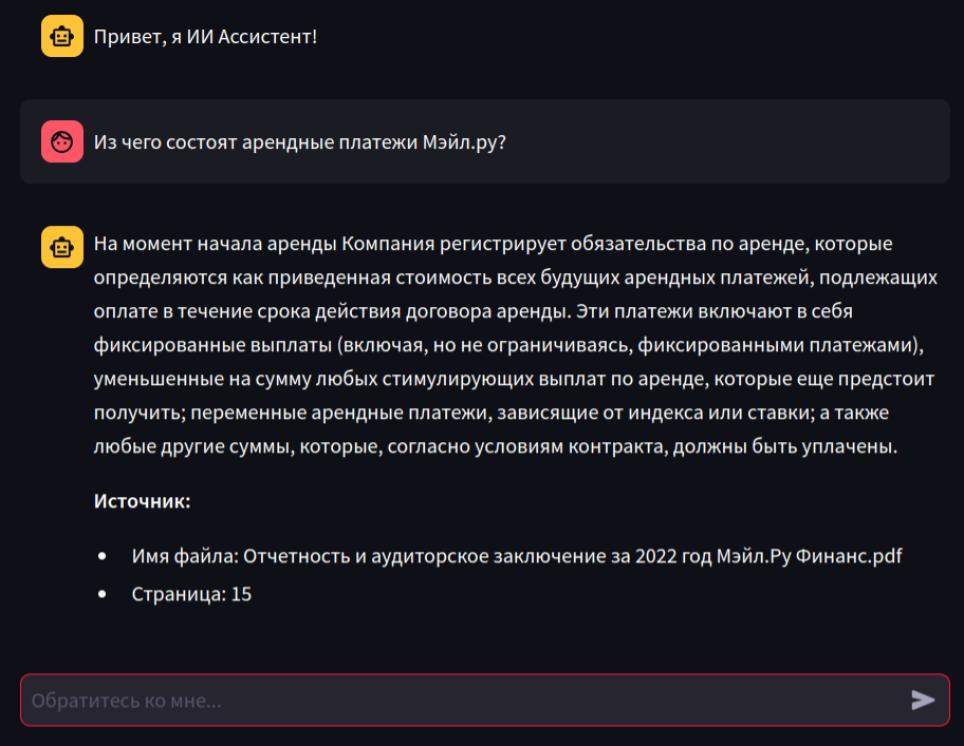
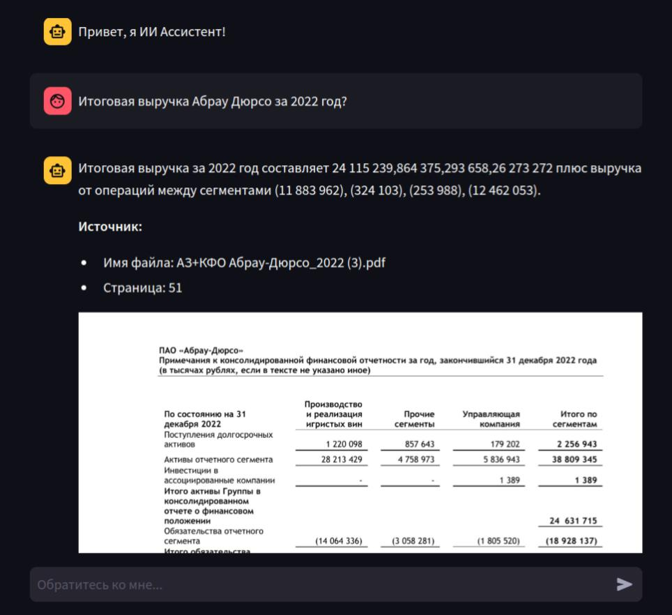
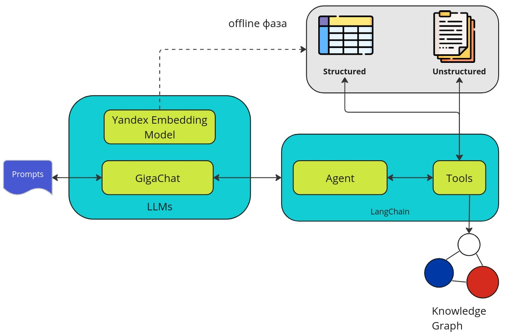

# ИИ Ассистент "Капитал"

### Разработан в рамках [Hack Genesis 2024](https://hackgenesis.com/) командой "Счастье не за горами".

### Live версия доступна [тут](http://213.189.201.69:8501/)

## Use Cases

### Поиск по неструктурированным данным (качественные вопросы)




Поиск информации по заданной тематике на основе неструктурированных данных (текста).

----

### Поиск по структурированным данным (количественные вопросы)



Поиск информации по заданной тематике на основе структурированных данных (таблиц).

----

### И многое другое TO BE DONE...

## Архитектура решения



* Движок ассистента разработан на основе LangChain. 
* В качестве LLM используется GigaChat, который обогащён инструментами (Tools) и инструкциями (Prompts) для взаимодействия с внешним миром. 
* Yandex GPT Embeddings используется для RAG подхода.
* Графы знаний используются для хранения метаданных компаний.
 
### Структура проекта

```
├── app # основная директория проекта
│   ├── common # содержит tools.py
│   ├── chatbot.py # стартовый файл проекта
├── data # содержит данные и БД для проекта
├── docker-compose.yml
├── Dockerfile
├── README.md
├── requirements.txt
└── resources # ресурсы проекта
```

# How to run? Запуск решения

## Development

0. Install requirements

```
pip install -r requirements.txt
```

1. Create `.env` in the `./app` dir

```
AUTH_DATA=GIGACHAT AUTH DATA
SCOPE=GIGACHAT_API_PERS
FOLDER_ID=Folder Id for Yandex GPT
API_KEY=API Key for Yandex GPT
```

2. Run with Python from the `./app`

```
python3.10 -m streamlit run chatbot.py
```

## Production with Docker

0. Set the DockerHub mirrors: 

`sudo nano /etc/docker/daemon.json`

Paste this

```
{
  "registry-mirrors": ["https://mirror.gcr.io", "https://gallery.ecr.aws"]
}
```

Restart docker daemon: `sudo systemctl restart docker`

1. Create `.env-prod` in the `./app` dir

```
AUTH_DATA=GIGACHAT AUTH DATA
SCOPE=GIGACHAT_API_PERS
FOLDER_ID=Folder Id for Yandex GPT
API_KEY=API Key for Yandex GPT
```

2. Run with docker-compose in the root dir

```
docker-compose build
docker-compose up
```

3. Use it on port `8501` by default